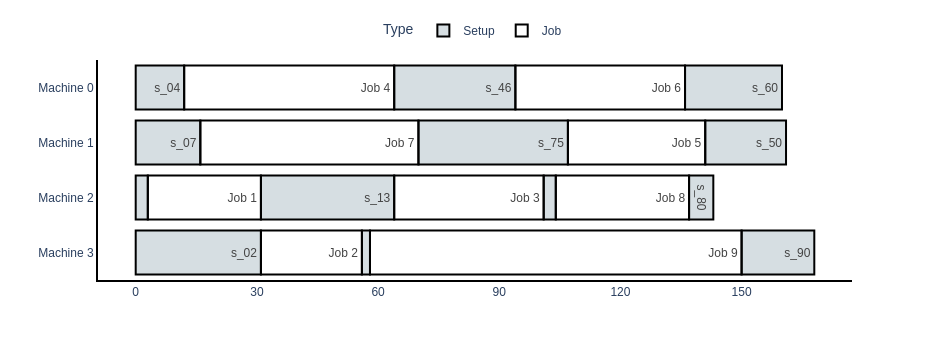

# R|s_ij|C_max — Parallel Machine Scheduling Solver

A REST API for solving the **Unrelated Parallel Machine Scheduling** problem with sequence-dependent setup times, minimizing makespan (C_max).

## The Problem

This project tackles the scheduling problem **R|s_ij|C_max** in the standard three-field notation:

| Field | Meaning |
|-------|---------|
| **R** | Unrelated parallel machines — each machine may process jobs at a different speed |
| **s_ijk** | Sequence-dependent setup times — setup durations depend on both the machine and the pair of consecutive jobs |
| **C_max** | Objective: minimize makespan |

In other words, given a set of jobs and a set of machines, where each job can be processed on any machine, must be processed exactly once, has a machine-dependent processing time, and incurs a setup time that depends on both the machine and the sequence of jobs, the goal is to determine the assignment and ordering of jobs on machines that minimizes the makespan.

---

## Mathematical Model

The optimization model is formulated as a Mixed-Integer Program. A formal LaTeX document with the complete formulation is included in this repository: [`model.tex`](./model.tex).

The model uses **lazy constraints** to handle the sub-tour elimination constraints. These are constraints whose full set is exponentially large but which can be enforced incrementally: the solver is run, if any violated constraint is identified, it is added to the model, and the solver is re-run. This process repeats until no violation is found.

> In **Julia + JuMP**, lazy constraints can be declared natively.
> In **Python + Pyomo**, since no native lazy constraint callback interface was found, the approach implemented here consists of solving the model, checking the solution for violated sequencing constraints, explicitly adding any violated constraints to the model, and re-solving it. This process is repeated until all constraints are satisfied.

## Project Structure

```
R-s_ij-Cmax/
├── pmsp/               # Core solver module (model, lazy constraint loop, I/O)
├── test/               # Test instances and expected solutions
├── api.py              # Flask REST API
├── ex_api_call.py      # Example client script
├── model.tex           # LaTeX formulation of the MIP model
├── Dockerfile          # Container deployment
└── requirements.txt    # Python dependencies
```

---

## Tech Stack


| Component | Technology |
|------------|------------|
| Language | Python 3.x |
| Optimization | [Pyomo](http://www.pyomo.org/) (MILP), [HiGHS](https://highs.dev/) via `highspy` |
| Database | SQLite (`sqlite3`) |
| Data Processing | Pandas, NumPy |
| Visualization | Plotly |
| Web Interface | Flask |
| Containers | Docker |


---

## Getting Started

### Running Locally

```bash
git clone https://github.com/Josa9321/R-s_ij-Cmax.git
cd R-s_ij-Cmax
pip install -r requirements.txt
python api.py
```

The server starts at `http://localhost:5000`.

### Running with Docker

```bash
docker build -t pmsp-api .
docker run -p 5000:5000 pmsp-api
```

---

## API Reference

### `GET /`

Checks whether the API is running.

**Response**

```text
PMSP app
```

**Status:** `200 OK`

---

### `POST /cmax`

Solves a scheduling instance and returns the optimal schedule.

**Headers**

```http
Content-Type: application/json
```

**Request Body**

Send a JSON object containing:

- `m`: number of machines
- `n`: number of jobs
- `processing_time`: machine × job processing time matrix
- `setup_time`: machine × job × job sequence-dependent setup time matrix

Example:

```json
{
    "m": 4,
    "n": 10,
    "processing_time": [
        [0, 82, 27, 57, 52, 43, 42, 94, 83, 59],
        [0, 26, 79, 11, 1, 34, 80, 54, 46, 64],
        ...
    ],
    "setup_time": [
        [
            [0, 18, 96, 89, 12, 31, 27, 42, 69, 45],
            [57, 0, 9, 23, 26, 24, 30, 23, 36, 33],
            ...
        ],
        ...
    ]
}
```

**Response**

Returns the optimal schedule, makespan, and solution time.

Example:

```json
{
    "allocations": [-1, 2, 3, 2, 0, 1, 0, 1, 2, 3],
    "obj": 168.0000000000001,
    "sequences_set": [
        [0, 4, 6],
        [0, 7, 5],
        [0, 1, 3, 8],
        [0, 2, 9]
    ],
    "time": 8.14749402400048
}
```


| Field | Description |
|---------|-------------|
| `allocations` | Machine assigned to each job |
| `obj` | Makespan value |
| `sequences_set` | Job sequence on each machine |
| `time` | Solve time (seconds) |

**Status Codes**

| Status | Description |
|---------|-------------|
| `200` | Optimal solution found |
| `400` | Invalid or empty JSON |
| `500` | Solver or serialization error |


### Example Client

```bash
python ex_api_call.py
# Reads example_instance.json, posts to localhost:5000/cmax,
# writes result to example_solution.json
```

---

## Example

### Instance

Consider **4 machines** and **10 jobs** (9 jobs + 1 dummy job). Instance written in JSON can be found at [`example_instance.json`](./example_instance.json).

### Optimal Solution

The solver returns the optimal job assignment and sequencing. Here, `J0` is a dummy job representing the initial state of a machine before any job is processed.

| Machine | Allocated Jobs | Job Sequence |
|----------|----------|----------|
| **M0** | 4, 6 | J0 → J4 → J6 → J0 |
| **M1** | 5, 7 | J0 → J7 → J5 → J0 |
| **M2** | 1, 3, 8 | J0 → J1 → J3 → J8 → J0 |
| **M3** | 2, 9 | J0 → J2 → J9 → J0 |

> **C<sub>max</sub> = 168**

### JSON Solution Format

```json
{
    "allocations": [-1, 2, 3, 2, 0, 1, 0, 1, 2, 3],
    "obj": 168.0000000000001,
    "sequences_set": [
        [0, 4, 6],
        [0, 7, 5],
        [0, 1, 3, 8],
        [0, 2, 9]
    ],
    "time": 8.14749402400048
}
```

### Visualization

The solution can be visualized as a Gantt chart:

```python
import json
import pmsp

instance = pmsp.load_json_file("example_instance.json")

with open("example_solution.json") as f:
    solution = json.load(f)

df = pmsp.create_solution_df(
    solution["sequences_set"],
    instance
)

pmsp.gantt_chart(df, setup_idx=0)
```

`pmsp.create_solution_df` converts a solution into a DataFrame with the columns `Machine`, `Task`, `Start`, `Finish`, `Type`, and `Time`. This DataFrame can then be used to generate a schedule visualization.


---

### Machine Utilization Analysis

Besides obtaining the schedule that minimizes the makespan, additional insights can be extracted from the solution. The function `pmsp.create_machines_df` summarizes how each machine spends its time.

```python
pmsp.create_machines_df(df)
```

**Output**

| Machine | Processing Time | Setup Time | Idle Time | % Production | % Setup | % Idle |
|----------|----------:|----------:|----------:|----------:|----------:|----------:|
| 0 | 94 | 66 | 8 | 55.95% | 39.29% | 4.76% |
| 1 | 88 | 73 | 7 | 52.38% | 43.45% | 4.17% |
| 2 | 98 | 45 | 25 | 58.33% | 26.79% | 14.88% |
| 3 | 117 | 51 | 0 | 69.64% | 30.36% | 0.00% |

Several observations can be made from this summary:

- Setup operations consume a substantial portion of the schedule. On **Machine 1**, setup activities account for more than **43%** of the total time.
- Even in the optimal solution, machines spend a significant amount of time preparing for production rather than processing jobs.
- **Machine 3** is the most utilized resource, remaining busy throughout the entire planning horizon with no idle time.
- **Machine 2** has the highest idle time, suggesting that balancing the workload more evenly may be difficult due to the interaction between processing and setup times.
- The results indicate that reducing setup times could have a significant impact on overall system performance, potentially yielding larger gains than improving processing times alone.

### Setup Time Analysis

The setup operations can also be examined individually:

```python
df[df.Type == "Setup"]
```

**Output**

| Machine | Setup | Duration |
|----------|----------|----------:|
| 0 | s₀₄ | 12 |
| 0 | s₄₆ | 30 |
| 0 | s₆₀ | 24 |
| 1 | s₀₇ | 16 |
| 1 | s₇₅ | 37 |
| 1 | s₅₀ | 20 |
| 2 | s₀₁ | 3 |
| 2 | s₁₃ | 33 |
| 2 | s₃₈ | 3 |
| 2 | s₈₀ | 6 |
| 3 | s₀₂ | 31 |
| 3 | s₂₉ | 2 |
| 3 | s₉₀ | 18 |

This table highlights which transitions are most expensive. For example:

- The setup from **J7 → J5** on Machine 1 requires **37** time units, the largest setup in the schedule.
- Several setups are relatively small (e.g., **J2 → J9** and **J3 → J8**), showing that some job sequences are naturally more compatible than others.
- The total setup time varies considerably across machines, reinforcing the importance of considering sequence-dependent setups when building schedules.

These analyses help explain *why* a schedule is optimal and can guide improvement efforts, such as setup reduction programs, machine specialization, or process redesign.

---
